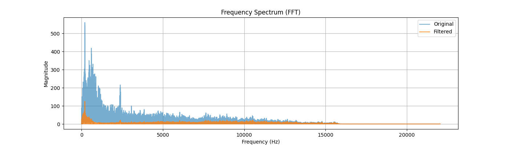
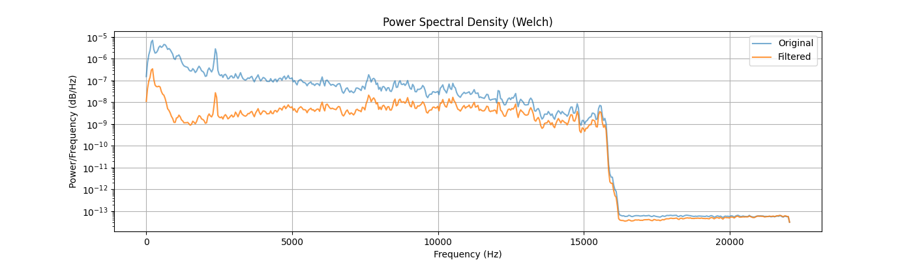

# Audio Denoising Using FIR Filtering 
 

A professional audio signal processing pipeline for noise reduction using custom FIR filters, with comprehensive analysis and visualization capabilities.

## Table of Contents
- [Key Features](#key-features)
- [Quick Start](#quick-start)
- [Installation](#installation)
- [Usage](#usage)
- [Project Structure](#project-structure)
- [Documentation](#documentation)
- [Contributing](#contributing)
- [License](#license)

## Key Features
✔ Advanced FIR filter design for targeted noise removal  
✔ Comprehensive frequency analysis (FFT, PSD)  
✔ Interactive visualization tools  
✔ Quantitative evaluation metrics (SNR, Spectral Flatness)  
✔ Batch processing capabilities  

## Quick Start
```python
# Example: Process a single audio file
from signal_loader import load_audio
from signal_processing import FrequencyAnalyzer

audio, rate = load_audio("dataset/seg_1.wav")
analyzer = FrequencyAnalyzer(audio, rate)
filtered = analyzer.apply_filter()
```

## Installation
1. Clone the repository:
```bash
git clone https://github.com/aimldlnlp/audio-denoising.git
cd audio-denoising
```

2. Install dependencies:
```bash
pip install -r requirements.txt
```

## Usage
### Basic Pipeline Execution
```bash
python main.py --input dataset/seg_1.wav --output results/seg_1
```

### Visualization
Generate visualizations for a single file:
```bash
python visualization/usage.py --input dataset/seg_1.wav
```

Batch process all files:
```bash
python visualization/batch_visualize.py
```

### Evaluation
Run evaluation metrics:
```bash
python evaluation/eval.py --noisy dataset/seg_1.wav --filtered results/seg_1/filtered_audio.wav
```

## Project Structure
```
denoising_audio/
│
├── README.md               # Project documentation
├── main.py                 # Main pipeline script
├── requirements.txt        # Dependency list
│
├── signal_loader.py        # Audio loading utilities
├── signal_processing.py    # Core processing algorithms
├── visualization.py        # Visualization utilities
│
├── dataset/                # Input audio files (.wav)
├── evaluation/             # Evaluation scripts
├── results/                # Analysis results
└── visualization/          # Visualization outputs
```

## Documentation
### Core Modules
- **`signal_loader.py`**  
  Handles audio file I/O operations using `soundfile` library.

- **`signal_processing.py`**  
  Contains the `FrequencyAnalyzer` class with methods for:
  - FFT analysis
  - PSD calculation
  - FIR filter design
  - Noise removal

- **`visualization.py`**  
  Provides plotting functions for:
  - Time-domain waveforms
  - Frequency spectra
  - Power spectral densities

## Contributing
We welcome contributions! Please follow these steps:
1. Fork the repository
2. Create your feature branch (`git checkout -b feature/AmazingFeature`)
3. Commit your changes (`git commit -m 'Add some AmazingFeature'`)
4. Push to the branch (`git push origin feature/AmazingFeature`)
5. Open a Pull Request

## License
Distributed under the MIT License. See `LICENSE` for more information.

## Sample Results
  
*Example frequency spectrum comparison*

  
*Example time domain comparison*

  
*Example psd comparison*

## Troubleshooting
Common issues and solutions:
- **File not found errors**: Ensure audio files are in the correct `dataset/` directory
- **Dependency errors**: Run `pip install -r requirements.txt --upgrade`
- **Visualization issues**: Check matplotlib backend configuration

## Roadmap
Planned future improvements:
- [ ] Real-time processing capability
- [ ] Web interface for interactive analysis
- [ ] Support for additional audio formats

## Contact
For questions or support:
- Project Maintainer: [Zidan]
- Email: z.zidan9123@gmail.com
- Issue Tracker: [GitHub Issues](https://github.com/aimldlnlp/audio-denoising/issues)
