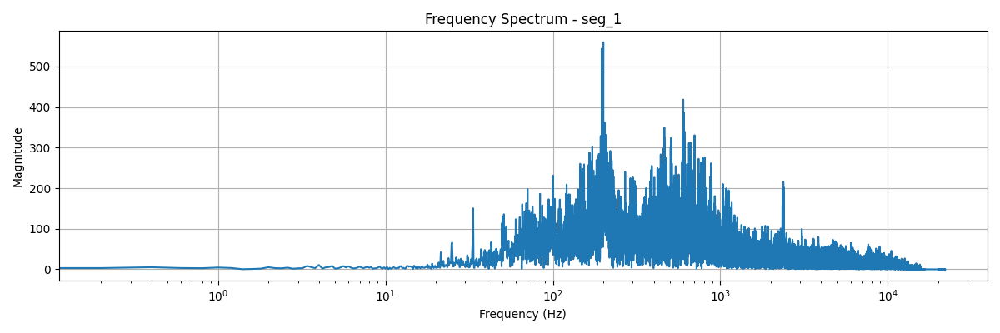

# Audio Noise Reduction Toolkit with FIR Multiband Filtering

[](https://www.python.org/)
[](https://opensource.org/licenses/MIT)
[](https://github.com/psf/black)



A comprehensive toolkit for audio noise reduction using FIR multiband filtering, along with advanced signal processing and visualization capabilities.

## Key Features

- **FIR Multiband Filtering**:
  - Effective noise reduction techniques
  - Customizable filter parameters for various audio signals
  - Enhanced audio quality through advanced filtering methods

- **Professional Visualization**:
  - Interactive time-domain plots
  - High-resolution frequency spectra
  - Filter response curves
  - Batch processing capabilities

- **Quality Metrics**:
  - Objective audio quality assessment
  - Noise floor analysis
  - Spectral distortion measurements

## Installation

### Prerequisites
- Python 3.8+
- pip package manager

### Recommended Setup
```bash
# Create and activate virtual environment
python -m venv venv
source venv/bin/activate  # On Windows use `venv\Scripts\activate`

# Install exact dependency versions
pip install -r requirements.txt
```

### Development Setup
```bash
# Install development dependencies
pip install -r requirements-dev.txt  # Includes testing and linting tools

# Verify installation
python -m pytest tests/
```

## Usage

### Basic Processing
```python
from signal_loader import SignalLoader
from signal_processing import FrequencyAnalyzer

# Load and process signal
signal = SignalLoader.load("dataset/seg_1.wav")
analysis = FrequencyAnalyzer.analyze(signal)

# Save results
analysis.save("results/seg_1/analysis.json")
```

### Advanced Visualization
```python
from visualization import EnhancedSignalVisualizer

# Generate professional quality plots
visualizer = EnhancedSignalVisualizer()
visualizer.plot_spectrogram("dataset/seg_1.wav", 
                          output_path="results/seg_1/spectrogram.png")
```

### Noise Reduction Example
```python
# Apply FIR multiband filter
from signal_processing import FrequencyAnalyzer

analyzer = FrequencyAnalyzer()
filtered_signal = analyzer.apply_filter(signal)

# Save filtered results
SignalLoader.save(filtered_signal, "results/seg_1/filtered_audio.wav")
```

## API Documentation

### Core Modules

#### `signal_processing.FrequencyAnalyzer`
```python
class FrequencyAnalyzer:
    """
    Performs comprehensive frequency analysis with these key methods:
    
    - analyze(signal): Full spectral analysis
    - estimate_noise_floor(): Calculate noise characteristics
    - apply_filter(): Digital filter implementation
    """
    ...
```

## Evaluation Metrics

The system calculates these professional audio metrics:
- Signal-to-Noise Ratio (SNR)
- Total Harmonic Distortion (THD)
- Perceptual Evaluation of Audio Quality (PEAQ)

## Contributing

1. Fork the repository
2. Create your feature branch (`git checkout -b feature/AmazingFeature`)
3. Commit your changes (`git commit -m 'Add some amazing feature'`)
4. Push to the branch (`git push origin feature/AmazingFeature`)
5. Open a Pull Request

Please ensure all code:
- Follows PEP 8 style guidelines
- Includes type hints
- Has corresponding unit tests

## License

Distributed under the MIT License. See `LICENSE` for more information.

## Contact

Project Maintainer: [Zidan] - z,zidan9123@gmail.com

Project Link: [https://github.com/aimldlnlp/denoising-noise-audio.git](https://github.com/aimldlnlp/denoising-noise-audio.git)
